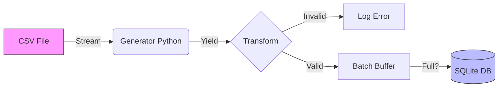

#  High-Performance ETL Pipeline (Python)

Pipeline de Engenharia de Dados capaz de processar e ingerir datasets massivos com consumo de memória constante.

## ⚡ Performance Benchmark
- **Dataset:** 1 Milhão de registros.
- **Tempo de Processamento:** ~2.4 segundos.
- **Estratégia:** Generators (Streaming) + Batch Insert (SQL).

## 🛠️ Tecnologias
- **Python 3.12+**
- **SQLite**
- **Logging**
- **CI/CD:** GitHub Actions

## ⚙️ Arquitetura
O projeto resolve o problema de "Memory Overflow" ao ler arquivos maiores que a RAM disponível:

1.  **Extract:** Leitura via `yield`.
2.  **Transform:** Normalização e validação de tipos com `Type Hints`.
3.  **Load:** Inserção em lotes (Batch Size: 5000) para otimizar I/O.

### Fluxo de Dados

## Como Rodar

**Gere o dataset de teste:**
- Bash:
python generate_data.py

**Execute o pipeline:**
- Bash:
python etl_processor.py

**Rode os testes unitários:**
- Bash:
python test_etl.py
